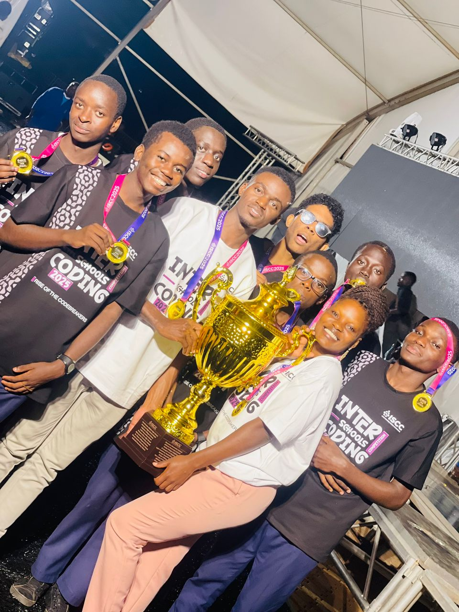

⚡ STAHIZA ICT HUB

  
 
 <strong>A cyber-themed static website showcasing Python projects, logic, and student-driven innovation.</strong> 
 
    

🚀 About STAHIZA ICT HUB

STAHIZA ICT HUB is a student-led technology showcase built to highlight Python programming skills, clean logic, and real-world problem solving.

The platform focuses on turning ideas into digital solutions — from simple scripts to intelligent, data-driven systems — all presented in a modern cyber / hacker-inspired interface.

🧠 What This Website Showcases

Python problem-solving projects

Logical and analytical thinking

Clean, maintainable code practices

Automation and data-driven solutions

Real-world inspired systems (transport, business, aviation)

🛠 Tech Stack

HTML5 – Structure

CSS3 – Cyber UI & animations

JavaScript (Minimal) – Interactivity

Python – Project logic & showcases

⚠️ This is a fully static website
No backend • No database • No authentication

📂 Project Structure
/
├── index.html
├── styles.css
├── script.js
├── public/
│   └── gallery/
│       ├── team-spirit.jpg
│       ├── coding-champions.jpg
│       └── the-hub-family.jpg
└── README.md
🧪 Featured Python Project Concepts

🛵 Ride Analytics System
Data analysis, earnings tracking, peak-hour detection

📦 Inventory & Sales Manager
OOP, file handling, business logic

✈️ Flight Operations Simulator
Scheduling, booking logic, revenue calculation

Each project emphasizes efficiency, logic, and scalability.

🌍 Purpose & Vision

STAHIZA ICT HUB exists to:

Promote digital problem-solving

Shift learners from tech consumers to creators

Encourage innovation through coding

Build confidence in real-world software development

🚀 Deployment

This site can be deployed easily on:

GitHub Pages

Vercel

Netlify

🤝 Contributing

Contributions are welcome!

Fork the repository

Create a feature branch

Commit your changes

Open a Pull Request

📜 License

This project is intended for educational, learning, and portfolio showcase purposes.

⚡ STAHIZA ICT HUB

Code • Logic • Innovation
